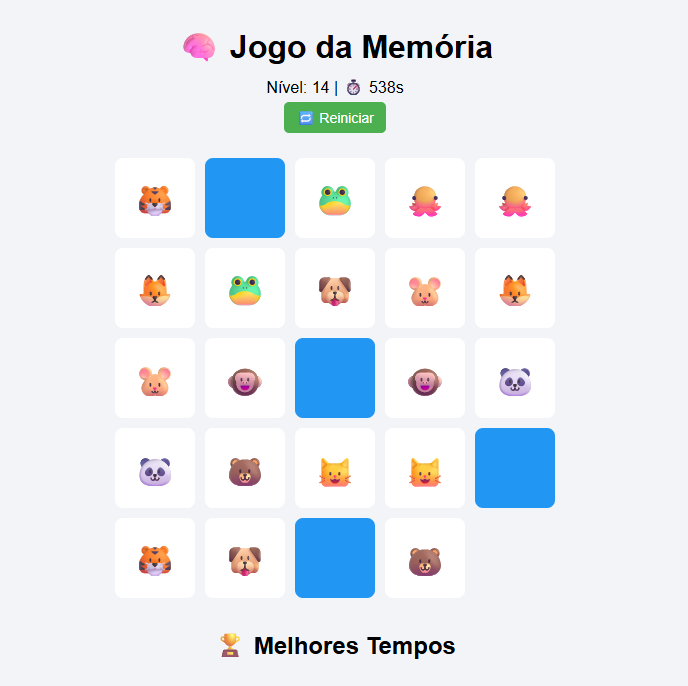

# 🧠 Jogo da Memória com Níveis

Este projeto foi desenvolvido no âmbito do curso **Técnico Especialista de Gestão e Programação de Sistemas Informáticos** – 2º ano, como parte da apresentação na **Feira das Profissões** na **Feira de Leiria** 🎓✨

## 🎯 Objetivo

O objetivo deste trabalho foi criar um jogo web interativo que desafie a memória do utilizador, integrando elementos de lógica, design e armazenamento local.  
Este projeto foi inteiramente desenvolvido com:

- 🌐 **HTML** – Estrutura e layout da aplicação  
- 🎨 **CSS (inline)** – Estilo visual embutido diretamente no `index.html`  
- ⚙️ **JavaScript** – Lógica do jogo, manipulação DOM, temporizador e rankings

---

## 🧱 Estrutura do Projeto

Todo o projeto está contido num único ficheiro: `index.html`.  
Este ficheiro contém:

- O **layout completo** do jogo com HTML semântico
- Estilos CSS **in-line** para personalizar o aspeto visual
- Um script JavaScript que:
  - Cria e embaralha os pares de cartas com ícones
  - Controla a lógica dos cliques e acertos
  - Gere os **níveis de dificuldade**
  - Calcula o **tempo de conclusão**
  - Regista os melhores tempos localmente no **LocalStorage**
  - Toca efeitos sonoros 🎵 ao acertar, errar ou vencer

## 🎮 Funcionalidades

- ✅ Níveis progressivos com número crescente de pares
- ⏱️ Temporizador em tempo real
- 🏆 Rankings locais por nível (Top 5)
- 📈 Dificuldade crescente a cada fase concluída
- 🔊 Feedback sonoro para cada ação

## 🎮 Demo

  

**Acesso:** [Memory Game Demo](https://julyduds.github.io/memory_game/)

📍 Este projeto foi apresentado na **Feira de Leiria**, com o propósito de mostrar o talento e as competências dos alunos do curso de **Técnico Especialista de Tecnologias e Programação de Sistemas de Informação**. Foi uma oportunidade incrível para partilhar conhecimento com o público e com outros colegas da área! 🙌

## 👤 Créditos

Trabalho realizado por:
- [Juliana Alves](https://github.com/JulyDuds)
- [Babi Sobrinho](https://github.com/babisobrinho)
- [Lenice Soares](https://github.com/lenicesoaares)
- [Rebeca Santos](https://github.com/RebecaSantosb)
- [Aline Armando](https://github.com/kiamy6)
- [Thalyson Santos](https://github.com/taysoic)
- [Diogo Simão](https://github.com/ritmico1)

📚 IEFP Leiria
🛠️ Desenvolvido com dedicação, criatividade e paixão pela tecnologia! ❤️‍🔥
